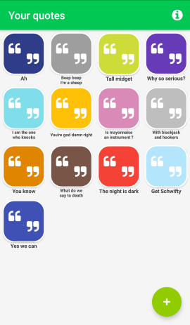
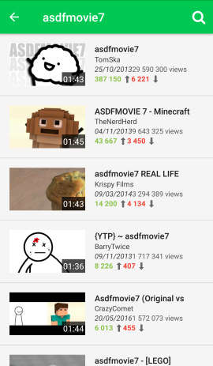
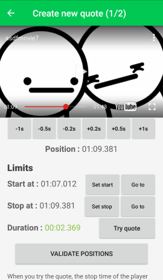
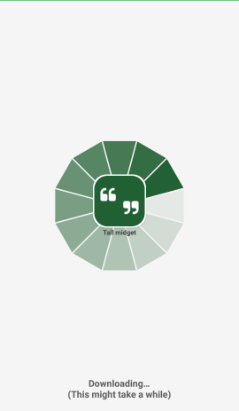

# QuoteBox Beta 1.6

## Description
QuoteBox is a simple soundbox tool in which you can extract a part of any Youtube™ video and play "quotes" (the extracted sound) indefinitely without Internet. QuoteBox doesn't use a server for processing the different steps but will use instead Youtube-dl and FFmpeg libs.

[Youtube Presentation here](https://youtu.be/dq3tDnNDY18)

[Download APK here](https://github.com/Klemek/QuoteBox/releases/download/v1.6.1-beta/quotebox-beta-1.6.1.apk)

## Current features

* Offline use of created quotes
* Whole Youtube™ search
* Customizable quote with color and name
* Full editor interface
  * Easy navigation through video
  * Precises start and stop points placing
  * Try quote before creating
* 1-20 seconds quotes
* Fade-out option

## Future features (soon) :

* Quote organization with drag-n-drop
* Quote marketplace for sharing and downloading other's quotes
* Quote image taken from thumbnail or user's files (or video itself)

## Changelog
### Beta 1.6.1

* New icon

### Beta 1.6.0

* Got rid of QPython thanks to yausername's youtubedl-android
* Fixed API key misuse

### Beta 1.5.3

* Fixed Youtube_dl ssl certificate error
* Added timeout to avoid stuck in splash

### Beta 1.5.2

* Switching from com.hypipal.qpyplus to org.qpython.qpy
 * Sometimes stuck in splash (timeout to do)
 * Cannot upgrade youtube_dl (pip cannot uninstall previous)
 * Youtube_dl ssl certificate error
* Fixed int overflow in video views or likes

### Beta 1.5.1

* QuoteTube -> QuoteBox
* Fixed Android N Qpython install

### Beta 1.5

* Slightly changed colors
* Suggestions in youtube searching
* French translation
* Multiline on quote name
* Welcome and update messages
* Update detection
* Some fixes

### Beta 1.4

* You can now edit quote from main list
* Some fixes

### Beta 1.3

* Fixed last QPython sh!t by downloading and installing a working version (1.2.5) on the user's phone
* Fixed quote edition when buttons weren't working sometimes
* Splitted quote creation into 2 phases (positions and informations)

## Libs

* [FFmpeg Android](http://writingminds.github.io/ffmpeg-android-java/)
* [youtube-dl](https://rg3.github.io/youtube-dl/)
* [youtubedl-android](https://github.com/yausername/youtubedl-android)
* [GeometricProgressView](https://android-arsenal.com/details/1/5376)
* [ColorPicker](https://android-arsenal.com/details/1/5067)
* [MaterialDialog](https://github.com/afollestad/material-dialogs)
* [Picasso](http://square.github.io/picasso/)
